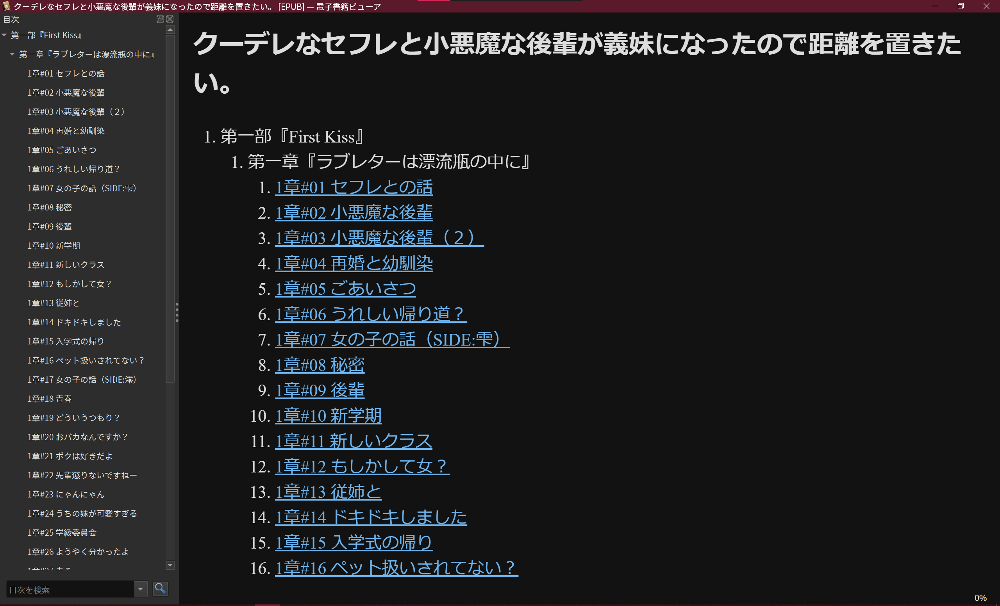

# Kakuyomub
<p align="center">
  
</p>
Usage:

```bash
pip install -r requirement.txt
python src\main.py WORK_ID
```
or

```bash
pip install kakuyomub
```
replace the ```WORK_ID``` with the カクヨム work id


## EXAMPLE
the url of 「クーデレなセフレと小悪魔な後輩が義妹になったので距離を置きたい。」 is https://kakuyomu.jp/works/16817330668128729529

The id of the work is the last trunk of the url, which is 16817330668128729529
```bash
# use the id to download work
python .\src\main.py 16817330668128729529
```

and the result is as:

