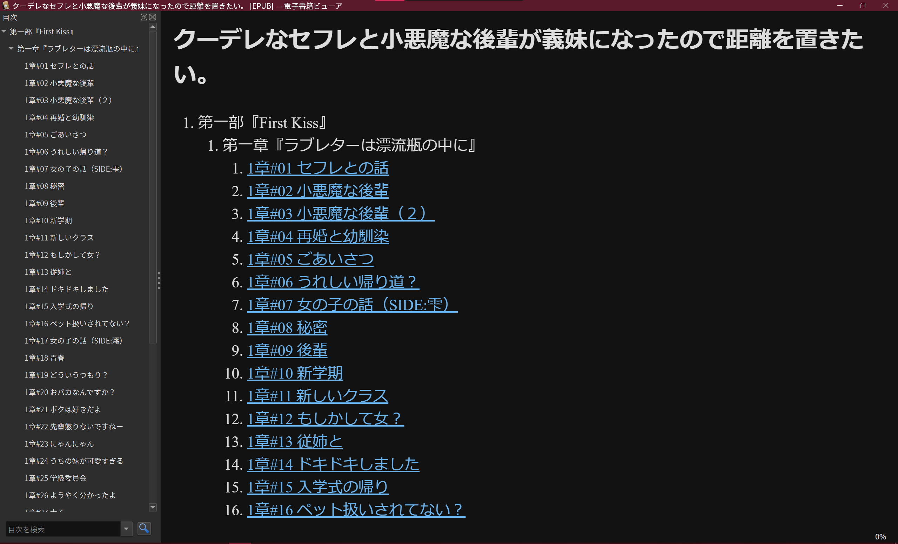

# Kakuyomub
<p align="center">
  
</p>
Usage:

Make sure python is available, then
```bash
git clone https://github.com/XHLin-gamer/kakuyomub.git
cd kakuyomub
pip install -r requirement.txt
python -m kakuyomub.main WORK_ID 
```
or if you want to point the downloaded file to a folder:
```bash
python -m kakuyomub.main WORK_ID --path C:\Users\xhaug\OneDrive\Desktop
```

```bash
pip install kakuyomub
>>> kakuyomub.download(16817330650993330082, "./")
```
replace the ```WORK_ID``` with the カクヨム work id.

CLI is also available with ```download_novel.py```
```bash
git clone https://github.com/XHLin-gamer/kakuyomub.git
cd kakuyomub
pip install -r requirement.txt
python download_novel
```
and then paste the **url** of the novel you want to download.(yes, you can paste the link of page like https://kakuyomu.jp/works/16817139554696751535 to the shell directly.)

## EXAMPLE
the url of 「クーデレなセフレと小悪魔な後輩が義妹になったので距離を置きたい。」 is https://kakuyomu.jp/works/16817330668128729529

The id of the work is the last trunk of the url, which is 16817330668128729529
```bash
# use the id to download work
python -m kakuyomub.main 16817330668128729529
```

and the result is as:

